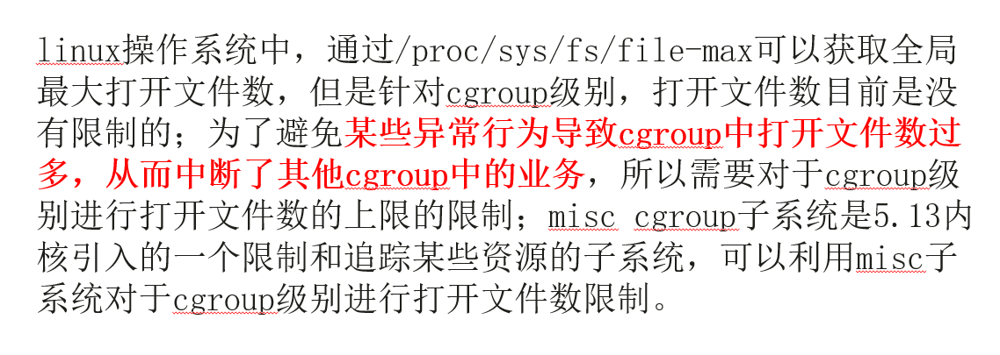
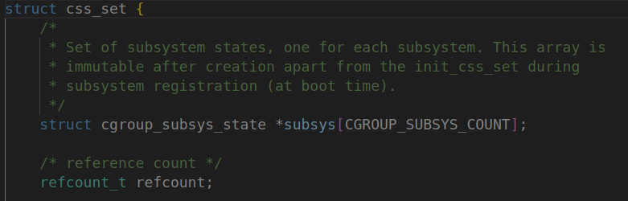
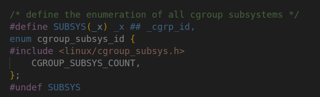

## 项目要求

------

- misc cgroup基本功能

- 基于misc cgroup子系统来实现cgroup级别的限制文件打开数的功能

- 编写测试用例，验证功能效果

- 项目描述

  

- 相关代码

  

## Cgroups的相关概念

------

- task：在Cgroups中，task就是系统的一个进程
- cgroup：Cgroups的资源控制单位，表示按照某种资源控制标准划分而成的**任务组**，可以包含一个或多个子系统
- sub-system：资源调度控制器，比如CPU子系统可以控制CPU时间分配，memory子系统可以限制cgroup的内存使用量
- hierarchy：由cgroup构建而成的树状结构

它们之间的关系如下

> 一个名为cpu_mem_cg的hierarchy包含了cpu和memory两个子系统，由cg1和cg2两个cgroup构成。系统中的一个进程可以加入cg1或cg2（但不能同时加入同一hierarchy下的两个cgroup中）。

## 相关的数据结构

------

- each task (process) has a pointer to a **css_set**

  

  ​																										/include/linux/cgroup-defs.h

  

  ​																										/include/linux/cgroup-defs.h

- each css_set has a set of pointers to **cgroup_subsys_state** objects (one for each cgroup subsystem)

  

## 相关代码流程

------

open的流程：/fs/open.c: do_sys_open ——> /fs/open.c: do_sys_openat2 ——> /fs/namei.c: do_filp_open ——> /fs/namei.c: path_openat ——> /fs/open.c: vfs_open ——> **/fs/open.c: do_dentry_open**

close的流程：/fs/file.c: close_fd ——> /fs/open.c: filp_close

## 目前所做的修改

------
- 修改了/fs/open.c的do_dentry_open函数
- 在/fs/open.c中 "#include <linux/misc_cgroup.h>"
- 修改了/fs/open.c的filp_close函数
- 在/include/linux/misc_cgroup.h的enum misc_res_type中添加了一个枚举项：MISC_OPEN_FILE
- 在/kernel/cgroup/misc.c的misc_res_name数组中添加了一个字符串元素："misc_open_file"
- 在/init/main.c中 "#include <linux/misc_cgroup.h>"
- 在/init/main.c——>start_kernel——>cgroup_init()后面添加了misc_cg_set_capacity
- 修改了/kernel/cgroup/misc.c的misc_cg_try_charge函数err_charge部分
- 修改了/kernel/cgroup/misc.c的misc_cg_max_write函数

## 编译linux内核并运行

------

[tutorial](https://offlinemark.com/2020/09/26/how-to-set-up-a-minimal-linux-kernel-dev-environment-on-ubuntu-20-04/)

## 测试文件编写

------

- [x] 不设置misc cgroup，程序不断打开文件
- 期望结果：超过系统规定能打开的最大文件数后，程序无法再打开文件
- [软限制和硬限制](https://blog.51cto.com/techsnail/2137383)
- [x] 设置单个misc cgroup，程序不断打开文件
- 期望结果：超过misc cgroup限制后，程序无法再打开新文件
- [x] 设置单个misc cgroup，满足max > 软限制，程序不断打开文件
- 期望结果：超过软限制后，程序无法再打开新文件
- [x] 设置单个misc cgroup，程序不断打开-关闭文件
- 期望结果：打开文件增加cgroup计数，关闭文件减少cgroup计数，所以最后程序能正常运行直到循环结束
- [x] 设置单个misc cgroup，max = 200，程序1打开120个文件后，fork出程序2，在程序2中打开100个文件
- 期望结果：g1中的程序可以打开120个文件，g2中的程序只能打开80个文件
- [x] 程序不断打开不存在的文件
- 期望结果：无任何输出，打开不存在的文件不会增加misc cgroup中的计数
- [x] 创建两个misc cgroup（g1为父，g2为子），满足g2.max > g1.max。在g2中运行程序，尝试打开g2.max个文件
- 期望结果：g2无法打开g2.max个文件，因为g2打开的文件数同时会更新g1.current，当g1.current大于g1.max后，g2无法再打开新文件
- [x] 创建两个misc cgroup（g1为父，g2为子），g1.max = 500，g2.max = 300。在g2中先运行程序打开250个文件，然后在g1中运行程序尝试打开400个文件
- 期望结果：g1无法打开400个文件，理由同测试5
- [x] 创建两个misc cgroup（g1和g2为同级关系），设置g1.max = 2000（超出软限制），g2.max = 1000。分别在g1和g2中运行程序，打开对应的max个文件
- 期望结果：g1中的程序最多打开软限制个文件，但不影响g2中的程序打开g2.max个文件
- [x] 创建一个misc cgroup，向其中的max写入比整个misc cgroup的capacity还要大的值
- 期望结果：写入失败
- [x] 创建一个misc cgroup，首先设置其max为500，然后执行程序打开300个文件，但不关闭。然后向max中写入200
- 期望结果：写入失败

## 杂项

------

- 在我的实现中，程序运行时默认打开的标准输入、标准输出和标准错误没有计算在misc cgroup的控制范围内，因为在这三个打开之前，无法将进程的pid写入misc cgroup的tasks中
